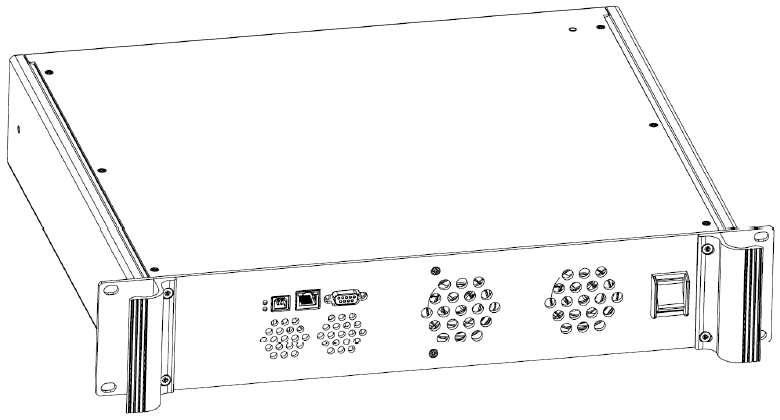

# DCS1K

**D**igital **C**urrent **S**ource **1K** Watt.

This is the implementation of the magnetical acctuator from based on the DCS1K from [STL](http://www.stl-gmbh.de/) for the [Semi-ATE](https://github.com/Semi-ATE/Semi-ATE) System.

Contact person for this handler is [Oliver Kawaletz](mailto:Oliver.Kawaletz@Micronas.com?DCS1K)   (+49 761 517-3515)

